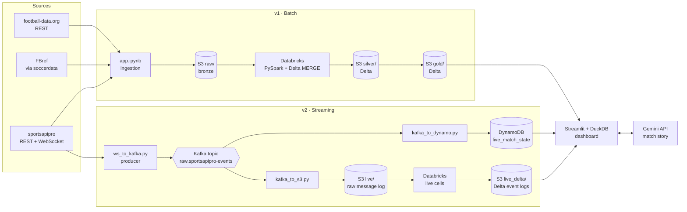

# Football Data Platform

**A batch and live data pipeline for the Premier League, from raw APIs to an analytics dashboard with an AI match story.**

Three football data providers, each delivering a different kind of data in a different shape, are
unified into one canonical model on S3 in Delta Lake format. A Streamlit dashboard queries it in
place with DuckDB. Alongside the batch pipeline, a Kafka streaming pipeline captures live matches
from a WebSocket feed and fans them out to DynamoDB for current match state and to S3 for full
message history. The dashboard uses both to replay how each match unfolded, and Gemini writes the
story of the match from the recorded data.

> **Live dashboard:** _link coming soon_ · **Walkthrough video:** _link coming soon_

| | |
|---|---|
| **Coverage** | 2 Premier League seasons (2025/26 complete, 2026/27 in progress)
| **Data model** | 3 sources (REST APIs, scraped stats tables, a live WebSocket feed) unified into one canonical model |
| **Streaming** | WebSocket → Kafka → DynamoDB (current state) + S3 → Delta (full history) |
| **AI** | Match stories generated by Gemini, grounded in the pipeline's own facts |
| **Runs on** | AWS S3 and DynamoDB, Databricks, Streamlit Community Cloud and Gemini |

---

## Architecture



**v1, batch.** Each source lands as-is in S3 under `raw/<year>/<source>/` (bronze). Databricks
builds a conformed silver layer of shared dimensions and facts, then gold tables shaped for each
dashboard page. The dashboard reads gold with DuckDB's `delta_scan` straight from S3.

**v2, streaming.** A producer subscribes to every Premier League match on the sportsapipro WebSocket
and publishes each raw frame to Kafka. Independent consumers turn that one stream into different
stores for different jobs.

---

## Engineering highlights

### One canonical model from three different sources

| Source | What it contributes | Shape |
|---|---|---|
| **football-data.org** | Competitions, fixtures and results, standings, clubs with crests and venues | REST, JSON |
| **FBref** (via `soccerdata`) | Advanced stats for teams, players and goalkeepers, per match and per season (standard, shooting, playing time, discipline, goalkeeping), plus lineups and match events | Scraped HTML tables with two-row headers |
| **sportsapipro** | Seasons, fixtures and standings, and the live feed: incidents, team and player stats, lineups and odds | REST, and WebSocket push messages |

- **Conformed dimensions.** `dim_season`, `dim_team` and `dim_players` carry every provider's
  identifiers, so a fact from any source joins on one key. That's how scraped match stats, API
  fixtures and live feed events can appear on the same match page.
- **Medallion lakehouse on S3.** Raw (bronze) → silver → gold, in the open Delta Lake format. There's
  no warehouse: DuckDB queries the Delta tables in place from the app.
- **Incremental, re-runnable loads.** Silver and gold tables are loaded with Delta `MERGE`
  upserts or full overwrites, so every step can be re-run safely.
- **Gold tables designed for the product.** Each gold table matches what a dashboard page needs:
  match summary, goals, cards, substitutions, lineups, standings, and team and player performance per
  match and per season.

### Kafka streaming: one stream, several destinations

```
                                  ┌──> DynamoDB: current state of each match  -> "what's the score now"
WebSocket ──> Kafka topic ────────┤
  (producer)  keyed by match id   └──> S3: append-only raw log ──> Databricks ──> Delta event logs
                                                                              -> "how did the match unfold"
```

- **The producer.** A WebSocket client subscribes to every live Premier League match (incidents,
  stats, lineups, odds) and publishes each raw frame to Kafka.
  - Writes are idempotent with `acks=all`.
  - Messages are keyed by match id, so each match's events stay in order.
- **Kafka decouples capture from processing.** The producer only captures. Each consumer has its
  own consumer group and offsets, so each can be replayed, re-run or added later without touching
  the others.
- **DynamoDB for serving the current state.** A single-table design keeps each match in one
  partition (`match_id`), with sort keys such as `STATS#home`, `LINEUP#<team>#<shirt>` and
  `INC#GOAL#<id>`. One query returns everything the dashboard needs for a match.
- **S3 and Delta for history.**
  - Every message is kept in an immutable, day-partitioned log. Files are never rewritten, which
    suits incremental processing.
  - Delivery is at-least-once, and duplicates are removed downstream on `(partition, offset)`.
  - Databricks flattens the log into per-type Delta event tables: goals, cards, substitutions, VAR
    decisions, added time, lineups and team stats.
- **Cost-efficient capture.** Consumers run as bounded replays: each reads from its committed
  offset to the end of the topic, then exits. Nothing has to stay running in the cloud during a
  match.

---

## Dashboard features

Every page reads a season from the URL, so any view can be shared as a link.

**Matches.** Every fixture of the season as a clickable card with crests, the score, date and
gameweek, and a *Live feed* badge on matches captured by the streaming pipeline.

**Match page**
- Score header, with the goals split by team: scorers, assists, and penalty, missed-penalty and
  own-goal markers.
- **Lineups.** Both starting elevens laid out on the pitch by formation, with substitutes.
- **Events.** A timeline of goals, cards and substitutions, with half-time and full-time markers.
- **Stats.**
  - *Teams:* formation and captain for each side, then head-to-head comparison bars and rows for
    possession, shooting (shots, on target, penalties), discipline (cards, fouls, offsides,
    tackles, interceptions, crosses) and goalkeeping (saves, save %, penalties faced and saved).
  - *Players:* full player and goalkeeper tables for both sides.
- **Live** (for captured matches)
  - *Summary cards* for score, xG, possession and shots.
  - *Timeline* of goals, cards, substitutions and VAR decisions, including disallowed goals, with
    half-time and full-time markers and added time.
  - *Match flow:*
    - an xG race chart with goal markers;
    - momentum bars per 5 minutes for touches in the box, shots, xG or final-third entries;
    - optional area charts for any of 9 stats over time, such as possession, big chances, pass
      accuracy, duels won and saves.
  - *Team stats* for the full match, first half or second half: attack, passing and defending.
  - *Leaderboard:* the top 10 players by goal threat (xG + xA), touches, accurate passes, duels
    won, recoveries or shots, each with a sparkline of how they built it up.
  - *Lineups and player stats* from the live feed.
  - *Match story:* one click, and Gemini writes the story of the match so far. After full time
    that's an overview plus first and second half; mid-match it's "up to half-time" plus "since
    the break".

**Teams.** A grid of every club in the season, each opening its own club page:
- *Matches:* the club's fixtures and results.
- *Team Stats:* season metrics in five groups (standard, shooting, goalkeeping, discipline,
  playing time).
- *Players Stats:* season tables for outfield players and goalkeepers.

**Standings.** The league table with total, home and away splits.

### The AI match story
- **Grounded generation.** The model never sees raw feeds. The pipeline builds a compact facts JSON
  for the part of the match recorded: events with minutes, per-half team stats, spells where one
  side was on top, and the top performers. Gemini writes prose from those facts only, using
  structured JSON output.
- **Automatic fact-checking.** Every number in the reply is checked against the facts. A reply with
  numbers that aren't there triggers one targeted retry; any sentence that still carries one is
  dropped.
- **Built for the free tier.**
  - Stories are generated only when requested, and cached per match state.
  - If a model is rate-limited, the next model in a fallback list is used.

---

## Tech stack

| Layer | Tools |
|---|---|
| Ingestion | Python, `requests`, `soccerdata` (FBref), Jupyter |
| Storage | AWS S3 (Delta Lake), AWS DynamoDB |
| Processing | Databricks (PySpark, Delta `MERGE`) |
| Streaming | WebSocket, Apache Kafka (`confluent-kafka`) |
| Serving | DuckDB (`httpfs`, `delta` extensions), Streamlit, Altair |
| AI | Google Gemini API (`google-genai`) |

---

## Repository layout

```
app.ipynb                          batch ingestion: one cell per source/endpoint -> raw/ + S3
databricks/
  Football_data_pipeline.ipynb     silver + gold Delta tables, and the live_delta tables
live/
  producer/ws_to_kafka.py          WebSocket -> Kafka
  consumer/kafka_to_dynamo.py      Kafka -> DynamoDB (current state per match)
  consumer/kafka_to_s3.py          Kafka -> S3 raw message log
  data/create_tables.py            one-time DynamoDB table setup
dashboard/
  app.py                           Streamlit entry point (multipage navigation)
  config.py                        table locations and settings
  data/                            all queries (DuckDB, DynamoDB), live history, match story
  components/                      UI building blocks per page section
  views/                           one file per page
raw/                               local mirror of what's uploaded to S3 raw/
```

---

## Running it locally

The dashboard reads from your own S3 bucket, so run the pipeline once to populate it. The live
pipeline is optional.

### Prerequisites
- Python 3.11+
- An AWS account with an S3 bucket (and a DynamoDB table for the live part). The code assumes
  `ap-south-1`; change `S3_REGION` in `dashboard/config.py` for another region.
- A Databricks workspace (Free Edition works) that can read and write the bucket.
- API keys: [football-data.org](https://www.football-data.org/) (free tier), sportsapipro, and
  optionally [Gemini](https://aistudio.google.com/) for the match story.
- Docker, for Kafka (live pipeline only).

### 1. Set up

```bash
git clone https://github.com/Rahulathreya45/Football-data.git
cd Football-data
python -m venv .venv && source .venv/bin/activate   # Windows: .venv\Scripts\activate
pip install -r requirements-pipeline.txt -r dashboard/requirements.txt
```

Create a `.env` in the repo root:

```bash
S3_BUCKET=your-bucket-name
AWS_PROFILE=your-sso-profile          # log in first: aws sso login --profile your-sso-profile
AWS_REGION=ap-south-1
FOOTBALL_DATA_ORG_API_KEY=...
API_FOOTBALL_KEY=...                  # sportsapipro key
GEMINI_API_KEY=...                    # optional: enables the Match story button
```

### 2. Batch pipeline (v1)
1. Run the ingestion cells in `app.ipynb` top to bottom. Each fetches one endpoint, saves it under
   `raw/` and uploads it to `s3://<bucket>/raw/`.
2. Add `databricks/Football_data_pipeline.ipynb` to Databricks (for example through a Git folder),
   point it at your bucket, and run the **Silver** then **Gold** sections.

### 3. Dashboard

```bash
streamlit run dashboard/app.py
```

### 4. Live pipeline (v2, optional)

```bash
# Kafka (single-node KRaft broker)
docker run -d --name kafka -p 9092:9092 apache/kafka:latest

# One-time: create the DynamoDB table
python live/data/create_tables.py

# On match day: capture every Premier League match into Kafka
python live/producer/ws_to_kafka.py

# After the matches: replay the topic into DynamoDB and S3
python live/consumer/kafka_to_dynamo.py
python live/consumer/kafka_to_s3.py
```

Then run the **Live** cells in the Databricks notebook to build `live_delta`. Captured matches get
a *Live feed* badge and a **Live** tab on their match page.

---

## Deploying to Streamlit Community Cloud

1. Create an app from this repo with entry point `dashboard/app.py` and Python 3.11+. Dependencies
   come from `dashboard/requirements.txt`.
2. In the app's **Secrets**, add:

   ```toml
   S3_BUCKET = "your-bucket-name"
   GEMINI_API_KEY = "..."

   [aws]
   access_key_id = "..."
   secret_access_key = "..."
   ```

   Use an IAM user with read-only access: `s3:GetObject` and `s3:ListBucket` on the bucket, and
   `dynamodb:Scan`, `dynamodb:Query` and `dynamodb:GetItem` on `live_match_state`.

---

## Notes
- Data belongs to its providers; this is a non-commercial portfolio project.
